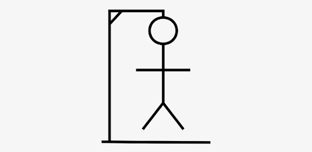
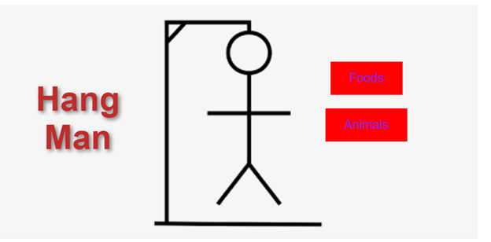
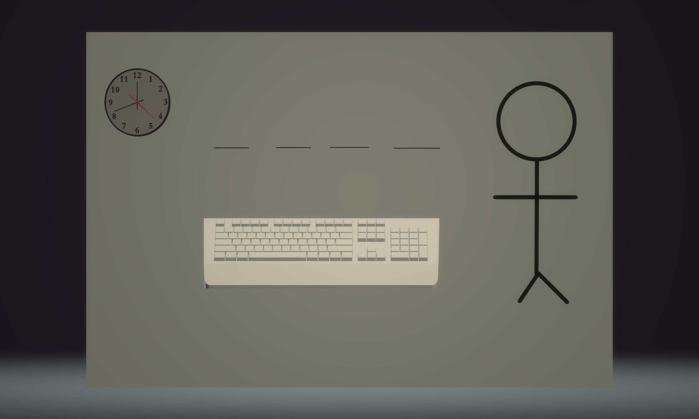
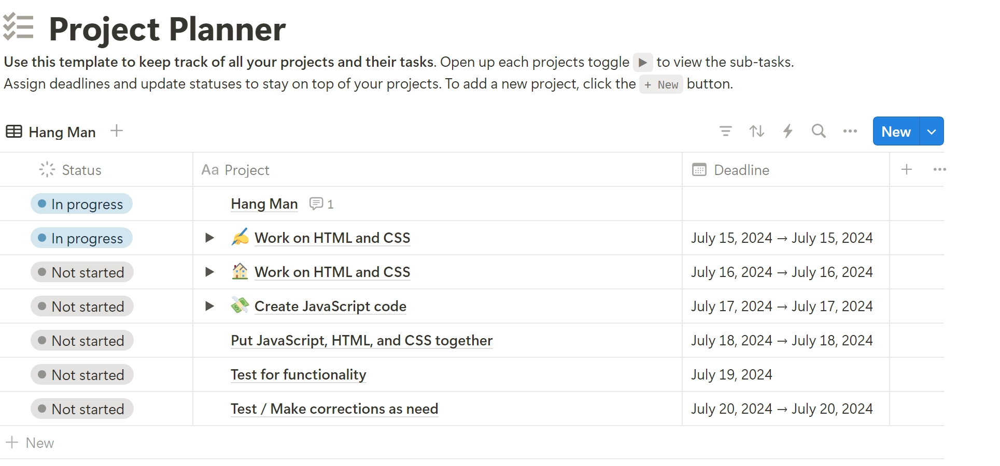

# Project Proposal 
Project Choice (Tell us which project you're doing!)

HangMan

## Project Description
My app is called Hang Man. It's a game app for a single player who wants to play Hang Man online. An player can join an online game and play a round of Hang Man. With the score being kept automatically and the game results displayed at the end of a round. Users will have the option to play again. In the future, I'd like to add a feature where one player can play against the computer.

## Wire Frames
Initial Landing View
### How to Play

     

## User Stories

### MVP Goals
* As a player I would like to see a leanding page were the game start.
* As a player I would like to see clear instructions in the UI.
* As a player I would like to be able to pick from a category of words to choise from.  
* As a player, I want my game to recognize words so I know if a player has won.
* As a player, I would like to be informed when the game is over.
* As a player, I would like to be informed when I make a selection to know my selection worked.
* As a player I would like to be able to restart the game after a win or loss 
### Stretch Goals
* As a player, I would like to see some type of victory animation when I win the game, so that I feel good about my victory!
### Notionboard Template
Notionboard template for building projects ( You can use this for any project ) 

### Timeline - Daily Accountability
| Day       |   | Task                                    | Blockers | Notes/Thoughts |
|-----------|---|-----------------------------------------|----------|----------------|
| Saturday  |   | Work on the HTML and CSS                |          |                |
| Monday    |   | Continue working on HTML and  CSS       |          |                |
| Tuesday   |   | Create The JavaScript                   |          |                |
| Wednesday |   | Work on JavaScript                      |          |                |
| Thursday  |   | Put JavaScript, HTML, and CSS together. |          |                |
| Friday    |   | Test for functionality                  |          |                |
| Saturday  |   | Test / rewrite /functionality           |          |                |

